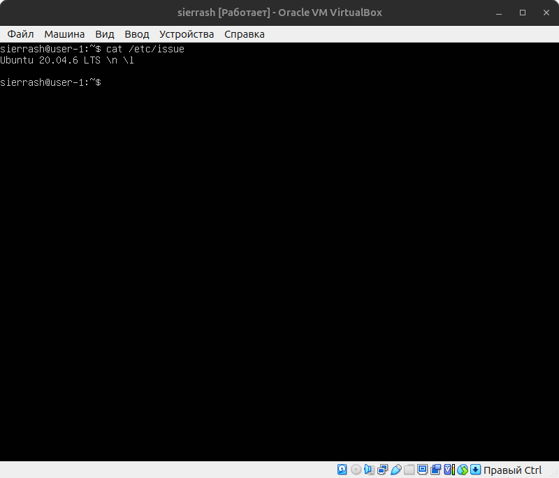
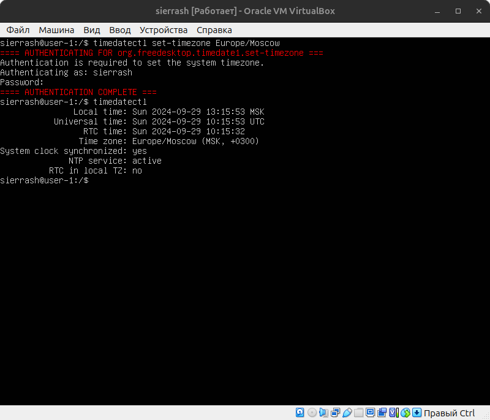
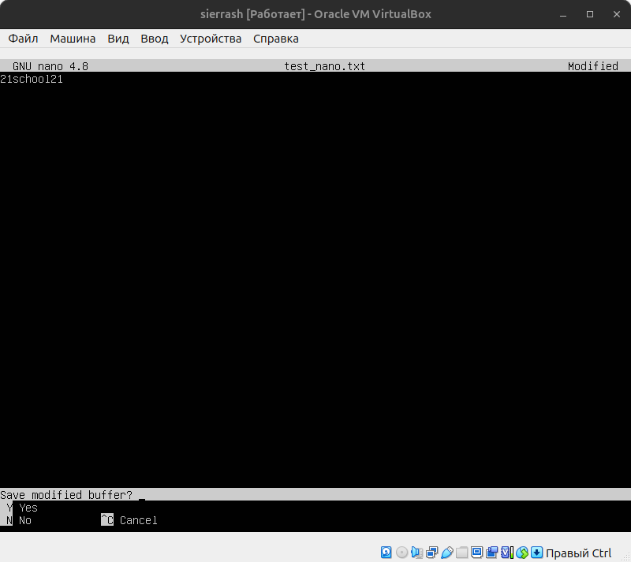
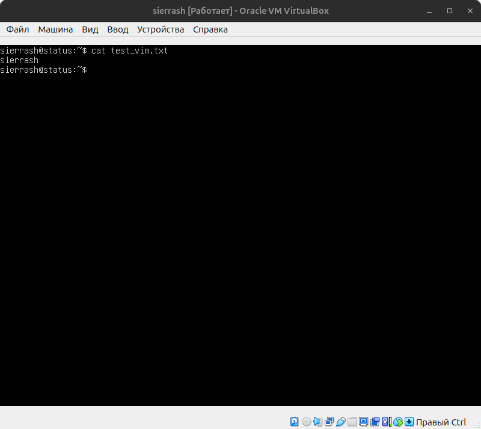

# Project DO1_Linux-1 report, sierrash

## Part 1. Installation of the OS

- We opened VirtualBox site and selected the latest version (7.0.16). Downloaded and installed it via instractions on the site.
- Chose OS Ubuntu 20.04 Server LTS in the VirtualBox program and created virtual machine.
- (For me it was needed to open BIOS and enable virtualisation in CPU Features).
- Then downloaded ISO of Ubuntu 20.04 Server LTS from the Ubuntu oficial site and have selected it in the window in VirtualBox.
- Installed OS without any of the automatic updates.
- Opened virtual machine and checked version of OS via the command `cat /etc/issue`.

## Part 2. Creating a user

- Applied command `sudo adduser part2_user` to add new user with name `part2_user`.

- Then wrote `sudo adduser part2_user adm` to add `part2_user` to `adm` group.
- Command `cat /etc/passwd` let us output all the users on the screen.

- Or, more simply, we could write `cat /etc/passwd | grep part2_user` to check only `part2_user` in the list. And to check if `part2_user` has the `adm` group, you can write `groups part2_user`.

## Part 3. Setting up the OS network

- We applies the command `sudo hostnamectl set-hostname user-0` to set machine's hostname to `user-0`. Then checked status of the hostname using `hostnamectl status`. If nothing has changed, you can restart system with `systemctl restart systemd-hostnamed`.

- Then we outputed current timezone via to `timedatectl` command.

- This command can also show the list of all timezones, if you write `timedatectl list-timezones` instead.

- We found `Europe/Moscow` timezone, closed the list with `^Z` and entered `sudo timedatectl set-timezone Europe/Moscow` in the terminal to set required timezone.

- Our next step was to show all the network interfaces. It could be done via either `ip link` or `ifconfig -a`.  Let us explain the presence of the `lo` interface: `lo` (loopback device) is a virtual network interface, which presented in each Linux distributive by default. It's needed for setting and launching network software and always has the same IP 127.0.0.1 and dns-name `localhost`.

- Let's output internal IP with `ip a` command and external IP with `curl ifconfig.me`. It could be more readable to add `-w "\n"` between the parts of the last command. External IP is unique IP-address that is given from the internet provider, but internal IP shows part of the local network. DHCP (Dynamic Host Configuration Protocol) is a network management protocol, that used for automatically assigning IP addresses and other communication parameters to devices connected to the network using a client–server architecture.

- Then found file with current netplan with command `ls /etc/netplan`. In our case it was `/etc/netplan/00-installer-config.yaml`. Used VIM to change the file (don't forget also to use `sudo`!). The `dhcp4` parameter should be changed from `true` to `false` to disable automatic IP assigning via DHCP. Then added parameters `addresses`, `gateaway4` and `nameservers: addresses` below. I assigned the first two parameters the same IPs that were assigned via DHCP and added Google and Cloudflare addresses at the `nameservers: addresses` line.

- We rebooted virtual machine and checked the correctness of the network settings.

- Then pinged remote hosts `1.1.1.1` and `ya.ru` via `ping` command and stoped it with `Ctrl + C` to see pings' statistics. As we want to see, there was no packet losing.

## Part 4. OS Update

- Applies command `sudo apt-get full-upgrade` to update OS and write `sudo reboot` to restart virtual machine. Typed first command again to check there are no more updates.

## Part 5. Using the sudo command

- Via `sudo usermod -aG sudo part2_user` added user from the Part 2 section to the `sudo` group. Explanation of `sudo` command: `sudo` is a program that enables users to run programs with the rights of the superuser (root).
- Then entered the `groups part2_user` command to check if `part2_user` belongs to `sudo` group.
- Final step of this part was to use the now familiar `sudo hostnamectl set-hostname` command to change the hostname (in ouw case it was `user-0-new`).

## Part 6. Installing and configuring the time service

- Install time synchronisation service via `sudo apt install systemd-timesyncd`.
- Write command `timedatectl show` to check, that output contains `NTPSynchronized=yes`.

## Part 7. Installing and using text editors

- VIM and NANO were text editors by default, so we installed JOE as the third choice with `sudo apt install joe`.
- Then we created three text files: `test_vim.txt`, `test_nano.txt` and `test_joe.txt` with the same content - `sierrash` line. Saved and closed each file.

- Then opened it again, wrote `21school21` instead of previous content and closed each file without saving.

- Checked, that closing withous saving changes nothing.

- In each text editor we used appropriate combination of keys, found necessary words and replaced it with another. In VIM it is `:s/<word-to-replace>/<word-replace-with>`; in NANO `Alt + R` and then confirm replacement with `Y`; in JOE use `^T` + `T`.

## Part 8. Installing and basic setup of the **SSHD** service

- Applied command `sudo apt install openssh-server` to install SSHD service. It could be necessary to use `sudo apt-get install ssh` firstly.
- Added this service to auto-start via command `sudo systemctl enable ssh.service`.
- We used VIM to open file `/etc/ssh/sshd_config` and deleted symbol `#` to uncomment line with `Port`. Then replaced number of port with `2022`.
- Wrote a command `ps -A | grep ssh`: `ps` shows processes, option `-A` allows to see all processes (even hidden), `grep ssh` prints only processes with `ssh` in names.
- Applied `netstat -tan` command. As before, option `-a` shows every connection. Option `-n` shows adresses and ports' numbers in digital format, and `-t` option shows only TCP/IP connections (it's necessary because SSH is TCP connection).
- Let's analyze the command output: 1. `Proto` is an abbreviation of "protocol" and means the connection type (`tcp` = TCP, `tcp6` = TCP for IPv6 protocol); 2. `Recv-Q` is short for "receive queue" and shows number of bytes, that are ready to be received from this socket (if the number is zero, then there is no data to be received); 3. `Send-Q` is similar to `Recv-Q`, but for sending; 4. `Local Address` is local (relative to this virtual machine) IP and port, that used by socket: a. `0.0.0.0:2022` - this socket was "listening" on port 2022 for all interfaces IPv4 (because `0.0.0.0` means "all IPv4 interfaces"), b. `127.0.0.1:53` - this socket was listening for localhost interface on port 53, c. `:::2022` - this socket was listening on port 2022 for all interfaces IPv6 (`::` means "all IPv6 interfacs"); 5. `Foreign Address` is IP and port, which are considered relative to external connections (here `0.0.0.0:*` and `:::*` mean, that socket hasn't connected to anything and just listening for input connection); 6. `State` is current state of the socket.

## Part 9. Installing and using the **top**, **htop** utilities

- Firstly we used `top` utility and determined several parameters: 1. uptime was 5:05; 2. number of authorised users was 1; 3. average system load was 0.00 (0.00, 0.00, 0.00); 4. total number of processes was 112; 5. cpu load was 0.0%; 6. memory load was 164.6 MiB (mebibytes); 7. pid of the process with the highest memory usage was 1 (with 0.2%); 8. pid of the process taking the most CPU time was 10 (with 5.5s).

- Then we used `htop` utility in several different modes. To sort data by `PID` parameter you need to apply the command `htop --sort-key PID` or to call utility itself, press F6 and choose desired parameter. Do the same for other parameters.

- To filter data by `sshd` process, press `F4` and enter the process name.

- To find `syslog` process, press `F3` and enter necessary prompt.

- To output data with additional information above, press `F2` and choose these parameters.

## Part 10. Using the **fdisk** utility

- Let's run the `fdisk -l` utility. Three last white sections are needed for us: they show names of disks, their sizes and numbers of sectors. `swap` size we determined with command `free -m`.

## Part 11. Using the **df** utility

- Then we ran the `df` command and determined several parameters for root partition: 1. partition size is 14339080 kb; 2. space used is 5806312 kb; 3. space free is 7782588 kb; percentage used is 43%.

- Let's do the same for output of the `df -Th` command: 1. partition size is 14G; 2. space used is 5.6G; 3. space free is 7.5G; percentage used is 43%.

## Part 12. Using the **du** utility

- To output data of the `du` utility in the readable view, we used the `-h` option, which literally means "human-readable". To ignore subfolders, we used the `-s` option.

## Part 13. Installing and using the **ncdu** utility

- Installed the `ncdu` utility and enter the desired folder (`/home`, `/var` and `/var/log`) to output its size.

## Part 14. Working with system logs

- We opened each of files via VIM. In the last one you can find last successful login time, user name and login method: `Sep 30 12:38:32`, `sierrash` and `pam_unix`.

- Then restarted SSHD service and opened `auth.log` one more time to check this changing.

## Part 15. Using the **CRON** job scheduler

- We created file for `CRON` scheduler and created command `*/2 * * * * uptime`.

- And finally deleted all tasks from the scheduler.

